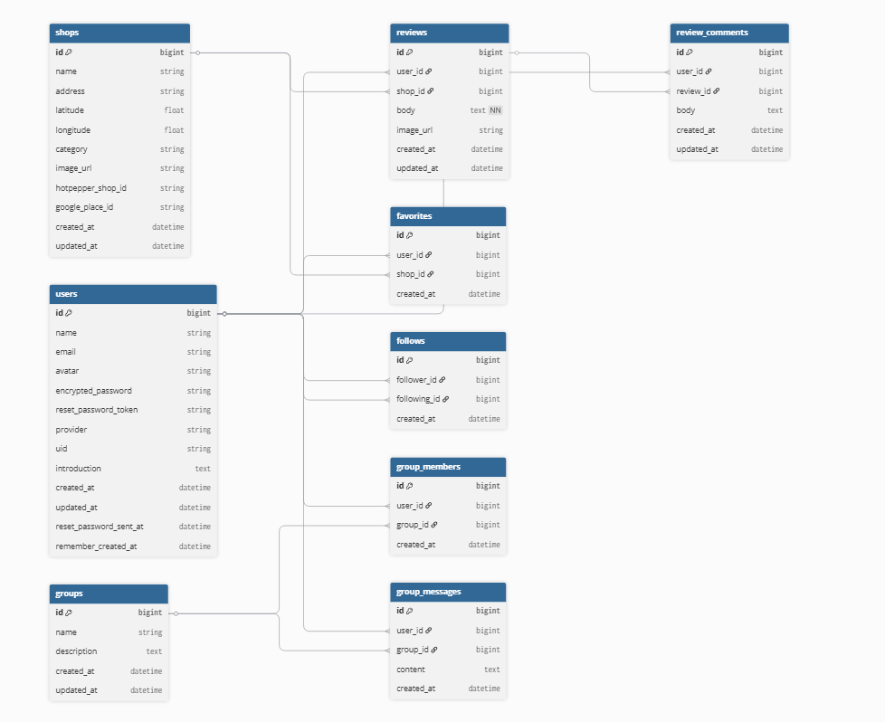

# 推しグルメ福岡

# ■ サービス概要  

推しグルメ福岡は、福岡県内の飲食店を
「ユーザーの推し」を軸に探せるグルメアプリです。
地図や検索機能を使ってお店を探しながら、
実際に訪れたユーザー同士が交流し、リアルな声を共有できます。
数値評価に頼らず、ユーザーの体験やおすすめを通じて
納得感のある店舗選びができることを特徴としています。

# ■ 開発背景

福岡はラーメンやもつ鍋をはじめとした魅力的なグルメが多い一方で、
「結局どこに行けばいいか分からない」「観光向けと地元向けの違いが分からない」と感じることが多くありました。
既存のグルメサイトは点数評価が中心で、
なぜそのお店が良いのかが伝わりづらいと感じていました。
そこで、「誰がそのお店をおすすめしているのか」が分かる形で、
人の声を軸にした福岡グルメアプリを作りたいと考えました。

# ■ ユーザー層について

福岡を訪れる観光客

● 地理や土地勘がなく、地図ベースで直感的に探したい方

● 有名店だけでなく、地元の人推しのお店を知りたい方 

福岡在住のグルメ好き

● 自分のおすすめを共有したい方

● 地元ならではの店を発信したい方

# ■ サービスの利用イメージ

ユーザーは店名やカテゴリから飲食店を検索し、
地図上で店舗の場所や周辺情報を直感的に確認できます。
店舗詳細では、実際に訪れた他のユーザーの
体験談や感想を参考にすることで、
数値評価に頼らない、信頼感のある判断材料を得ることができます。
また、ユーザー同士の交流を通じて、
リアルな声や体験を知ることもできます。

# ■ ユーザーの獲得について

X（旧Twitter）などSNS発信を軸にユーザーを獲得

# ■ サービスの差別化ポイント・推しポイント

数値評価ではなく「ユーザーのおすすめ」

多くのグルメサービスが星評価や点数を中心にしている中で、
本サービスでは 「誰がその店をおすすめしているか」 を重視しています。
実際に訪れたユーザーの体験やコメントを通じて、
数値だけでは分からないお店の魅力を知ることができます。

ユーザー参加型のグルメ情報

お店の基本情報は外部APIから取得し、
そこにユーザーのレビューやコメントを投稿できる仕組みです。
さらに、ユーザー同士が交流しながら情報を共有できるため、
使われるほどリアルで信頼性の高い情報が蓄積されていきます。

# ■ 機能候補

MVPリリース時

● ユーザー登録・ログイン

● プロフィール機能

● 店舗検索（店名・カテゴリ）

● Google Maps を用いた地図表示

● 店舗詳細表示

● レビュー・投稿機能

● 推し店舗の表示

● ユーザーによる店舗投稿

本リリース

● グループチャット機能

● お気に入り登録

● おすすめユーザーのフォロー機能

# ■ 使用する技術スタック

| カテゴリ | 技術 | 
| --- | --- |
| フロントエンド | React.js / Tailwind-css / DaisyUI |
| バックエンド | Ruby on Rails （APIモード） |
| データベース | PostgreSQL |
| 環境構築 | Docker |
| インフラ | Vercel / Render / Neon / Amazon S3 |
| ライブラリ | devise / devise_token_auth / devise-i18n / aws-sdk-s3 google-id-token / geocoder / kaminari / ransack |
| 外部API | Google Maps API / Google Places API / 外部飲食店API | 

※ 外部飲食店APIで取得できない店舗は、
Google Places API を用いてユーザーが追加できる設計としています。

# ■ ER図

